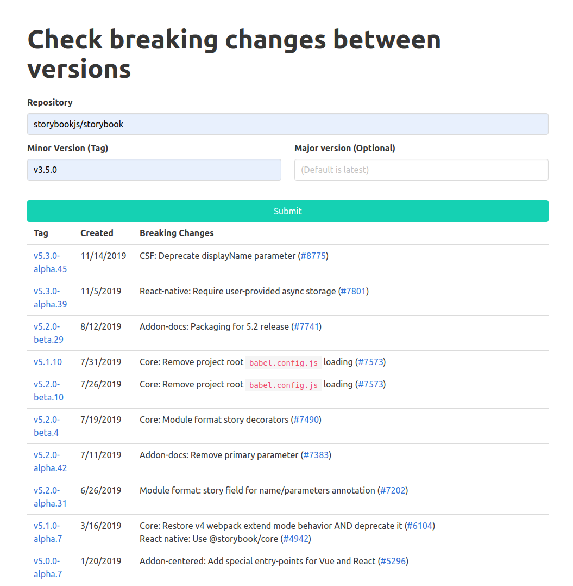

# github-breaking-changes

This tool provides very basic funcionality. If you would like something more advanced check out [Dependabot](https://dependabot.com/).

### Motivation

After a year of working in a JavaScript project I found multiple dependencies were outdated, which represents security vulnerabilities. In my attempt to upgrade I found really difficult to get a full list of breaking changes between two major releases of a package since GitHub doesn't have search funcionality on the releases page.
Dependabot is a tool that makes automatic PRs to your project when new versions of your dependencies are released but it doesn't work for Bitbucket hosted repositories.